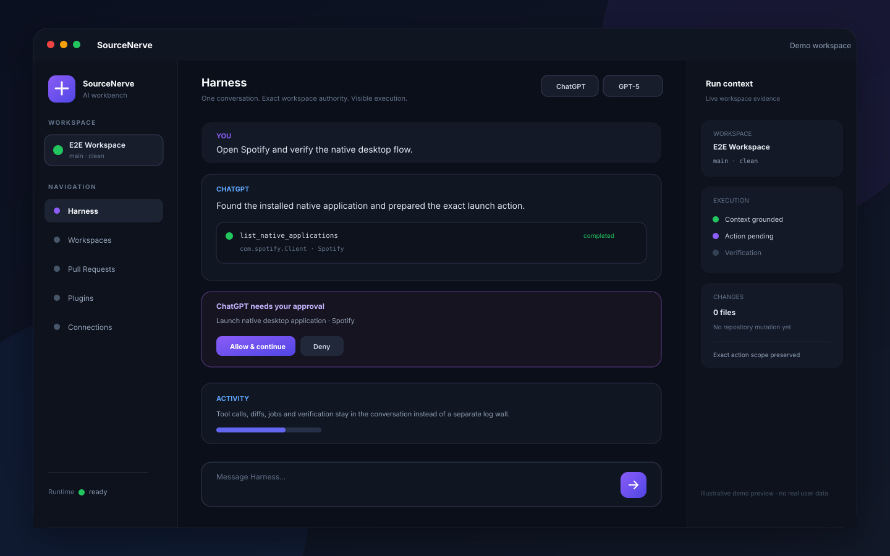

<p align="center">
  
</p>

<h1 align="center">SourceNerve</h1>

<p align="center">
  <strong>Give coding agents real tools without giving them unchecked control.</strong>
</p>

<p align="center">
  SourceNerve is a desktop workbench and local Harness for ChatGPT, Codex, MCP tools, Git workflows, and native computer use.
</p>

<p align="center">
  <a href="https://github.com/Fogewise-Tech/SourceNerve/releases/latest"></a>
  
  
  
  
</p>

<p align="center">
  <a href="#demo">Demo</a> ·
  <a href="#what-source-nerve-does">Features</a> ·
  <a href="#how-it-feels-to-use">Workflow</a> ·
  <a href="#install">Install</a> ·
  <a href="#for-builders">For builders</a>
</p>

---

## Demo

<p align="center">
  
</p>

<p align="center"><sub>Illustrative product preview built from the current Harness surfaces and demo data. No real user data is shown.</sub></p>

SourceNerve keeps the work in one place: your prompt, the selected workspace, tool calls, diffs, approvals, verification, and delivery state all stay visible in the conversation instead of being split across terminal windows and hidden agent logs.

---

## What SourceNerve does

<table>
  <tr>
    <td width="33%"><strong>🤖 One AI workbench</strong><br/>Use ChatGPT, native Codex, Goal, and Loop modes without changing repository tooling for each agent.</td>
    <td width="33%"><strong>🛡️ Guarded execution</strong><br/>Agents see and change only the workspaces and capabilities SourceNerve exposes.</td>
    <td width="33%"><strong>👀 Visible activity</strong><br/>Tool calls, diffs, jobs, approvals, and verification appear in the same working conversation.</td>
  </tr>
  <tr>
    <td><strong>🖥️ Browser + desktop control</strong><br/>Route browser tasks to browser automation and native-app tasks to guarded computer use.</td>
    <td><strong>🔌 Bring your own tools</strong><br/>Connect MCP servers and plugin skills without letting extensions redefine SourceNerve authority.</td>
    <td><strong>🚀 Ship from the same flow</strong><br/>Review changes, commit, push, open PRs, inspect CI, and merge through exact-state Git/provider operations.</td>
  </tr>
</table>

### The short version

You choose a repository and ask for work. SourceNerve gives the selected agent the smallest useful set of capabilities, streams what it is doing, keeps mutations tied to exact repository state, and verifies the result before the turn is considered complete.

It is designed for people who want agentic development to feel fast **without turning the agent into an unrestricted shell**.

---

## How it feels to use

A normal session is intentionally simple:

```text
Pick workspace
    ↓
Choose ChatGPT / Codex / Goal / Loop
    ↓
Describe the outcome you want
    ↓
Watch tool calls, changes and verification in chat
    ↓
Approve only when a real boundary needs your decision
    ↓
Commit / push / PR / release from the same workflow
```

Examples of the kind of requests SourceNerve is built for:

```text
Fix the failing CI, validate it, commit and push.
```

```text
Review this PR against the current codebase and post the review.
```

```text
Open Spotify on my desktop and continue the native UI flow.
```

```text
Implement this feature, keep iterating until the success criteria pass, then ship a release.
```

### Agent modes

| Mode | Good for |
| --- | --- |
| **ChatGPT** | Direct repository work, review, browser/native-tool orchestration, and user-facing reasoning. |
| **Codex** | Native local coding sessions where Codex owns the implementation thread. |
| **Goal** | A bounded outcome that may need multiple implementation + review iterations. |
| **Loop** | Repeated improvement inside one original brief until the loop has nothing useful left to do. |

Slash commands keep mode/model selection out of the way: `/agents`, `/model`, `/goal`, `/loop`.

---

## Why not just give an agent a terminal?

Because the hard part is not letting an agent run a command. The hard part is keeping authority, state, recovery, and delivery understandable after hundreds of commands.

SourceNerve keeps a few product rules stable:

| Rule | What it means in practice |
| --- | --- |
| **Workspace first** | An agent acts inside an explicitly configured repository, not an arbitrary host path. |
| **Exact state matters** | File writes, diffs, commits, pushes, and PR operations are checked against current Git/file state. |
| **Approvals are interaction, not failure** | When approval is genuinely needed, the turn waits in chat and can continue after the decision. |
| **Use the right surface** | Web tasks use browser tools; native desktop tasks use computer-use tools instead of silently opening a web substitute. |
| **Verification is part of the turn** | Tests, checks, and diff evidence are first-class output, not an afterthought. |
| **Extensions do not own authority** | MCP servers and plugin skills add capability, while SourceNerve keeps the policy boundary. |

---

## Highlights in 0.1.37

- Fedora RPM updates now keep SourceNerve responsive while the system authentication prompt is open.
- Installation waits for PolicyKit + `dnf` to finish successfully before SourceNerve relaunches.
- A cancelled authorization can be retried without downloading the update again.
- Completed downloads no longer stay on screen as a misleading **Downloading 100%** state.
- Approval UX remains an inline waiting state instead of a dead-end tool failure.
- Native app control and repository mutations still stay inside SourceNerve's guarded execution boundary.

---

## Install

### Download a Desktop build

Use the latest GitHub release:

**[Download SourceNerve Desktop](https://github.com/Fogewise-Tech/SourceNerve/releases/latest)**

| Platform | Stable artifacts |
| --- | --- |
| Fedora / Linux x64 | RPM, AppImage |
| Windows x64 | NSIS installer |
| macOS Apple Silicon | DMG, ZIP |
| macOS Intel | DMG, ZIP |

The current stable channel is unsigned/non-notarized. Platform signing helpers remain available for a future signed channel.

### First run

1. Open SourceNerve.
2. Complete the short Codex + ChatGPT setup.
3. Add a local Git repository as a workspace.
4. Open **Harness** and start chatting.
5. Connect GitHub/GitLab, plugins, or MCP extensions only when you need them.

You do not need to index a repository before SourceNerve can use it. Advanced repository intelligence can be supplied by enabled plugin skills or MCP extensions.

---

## Product surfaces

### Harness

The main working surface. It combines conversation history, workspace selection, agent/model choice, streamed activity, approvals, jobs, diffs, and run state.

### Workspaces

Registers the repositories SourceNerve is allowed to touch and records Git/provider metadata used by the rest of the product.

### Pull Requests

Browse and act on provider change requests without moving the task into a separate ad-hoc terminal workflow.

### Plugins + MCP

Add specialized repository intelligence, browser automation, design tools, issue trackers, or other external capabilities while preserving SourceNerve policy.

### Computer use

Optional guarded screen, clipboard, mouse, keyboard, and native-application capabilities. Browser work stays browser-scoped when possible; full desktop control is used only for actual OS/native UI tasks.

---

## Architecture, without the wall of text

```text
ChatGPT · Codex · Desktop UI · Plugin skills · MCP extensions
                         │
                         ▼
                SourceNerve Harness
       workspace scope · policy · approvals · audit
          exact-state mutation · verification
                         │
                         ▼
          Git workspaces · providers · native OS
```

The Rust service owns the authority boundary and durable state. The Electron desktop app owns the local product experience. Intelligence such as semantic search, code graphs, architecture analysis, and domain-specific workflows can come from plugins/MCP rather than being hard-coded into the core.

---

## For builders

Most users can stop reading here. The sections below are for contributors and operators.

<details>
<summary><strong>Run from source</strong></summary>

### Requirements

- Rust **1.88+**
- Git
- Node.js + npm
- `ripgrep`
- `gh` and/or `glab` for provider workflows

### Rust service

```bash
cp sourcenerve.example.toml sourcenerve.toml
cp .env.example .env 2>/dev/null || true
cargo run --release
```

Default local endpoints:

```text
API  http://127.0.0.1:7331
MCP  http://127.0.0.1:7331/mcp
```

### Desktop

```bash
cd desktop
cp -n .env.example .env
npm install
node scripts/materialize-product-profile.mjs
npm run dev
```

</details>

<details>
<summary><strong>Validation commands</strong></summary>

```bash
cargo fmt --check
cargo clippy --all-targets --all-features -- -D warnings
cargo test --all-features
```

```bash
cd desktop
npm run typecheck
npm test
npm run security:check
npm run release:contract
```

Native Codex E2E remains opt-in because it requires an installed Codex CLI and an existing ChatGPT-authenticated Codex environment:

```bash
npm run test:codex:e2e
```

</details>

<details>
<summary><strong>Workspace configuration</strong></summary>

```toml
[[workspace]]
id = "example"
name = "Example Repository"
root = "/absolute/path/to/repository"
access = "read-write"
remote = "origin"
default_branch = "main"
```

Configured workspace boundaries are authoritative for file access, execution, Git/provider actions, native Codex cwd, and plugin/MCP policy.

</details>

<details>
<summary><strong>Release model</strong></summary>

Stable desktop publishing is tag-driven from immutable tags named `desktop-vX.Y.Z`.

The release pipeline validates the Rust/Desktop version contract, runs quality/security checks, builds Linux/Windows/macOS artifacts, verifies updater manifests and aggregate checksums, then publishes the GitHub release atomically.

Primary workflow: `.github/workflows/desktop-release.yml`

</details>

---

## Security boundary

SourceNerve is a local policy and mutation boundary, not a general remote shell.

- Renderer code has no Node.js or provider-token access.
- Workspace file operations reject path escapes.
- Git mutation uses exact-state guards and does not expose arbitrary force-push/refspec behavior.
- Provider credentials stay on trusted daemon/Main-process surfaces.
- GUI escalation is separate from ordinary repository write authority.
- Unsupported or stale authority fails closed instead of silently widening the sandbox.

For deployments reachable outside a trusted machine/network, run SourceNerve as an unprivileged OS user and place suitable TLS/authentication in front of the service.

---

## Documentation

| Topic | Document |
| --- | --- |
| ChatGPT integration | [`docs/chatgpt-review-bridge.md`](docs/chatgpt-review-bridge.md) |
| Desktop architecture | [`docs/desktop-architecture-adr.md`](docs/desktop-architecture-adr.md) |
| Desktop security | [`docs/desktop-security-review.md`](docs/desktop-security-review.md) |
| Desktop release | [`docs/desktop-release.md`](docs/desktop-release.md) |
| Managed runtime | [`docs/desktop-managed-runtime.md`](docs/desktop-managed-runtime.md) |
| Git/provider lifecycle | [`docs/git-provider-lifecycle.md`](docs/git-provider-lifecycle.md) |
| Task lifecycle | [`docs/task-lifecycle.md`](docs/task-lifecycle.md) |
| Plugin packaging | [`docs/plugin-packaging.md`](docs/plugin-packaging.md) |
| Production operations | [`docs/production-operations.md`](docs/production-operations.md) |
| Release and recovery | [`docs/release-and-recovery.md`](docs/release-and-recovery.md) |

---

## License

MIT
